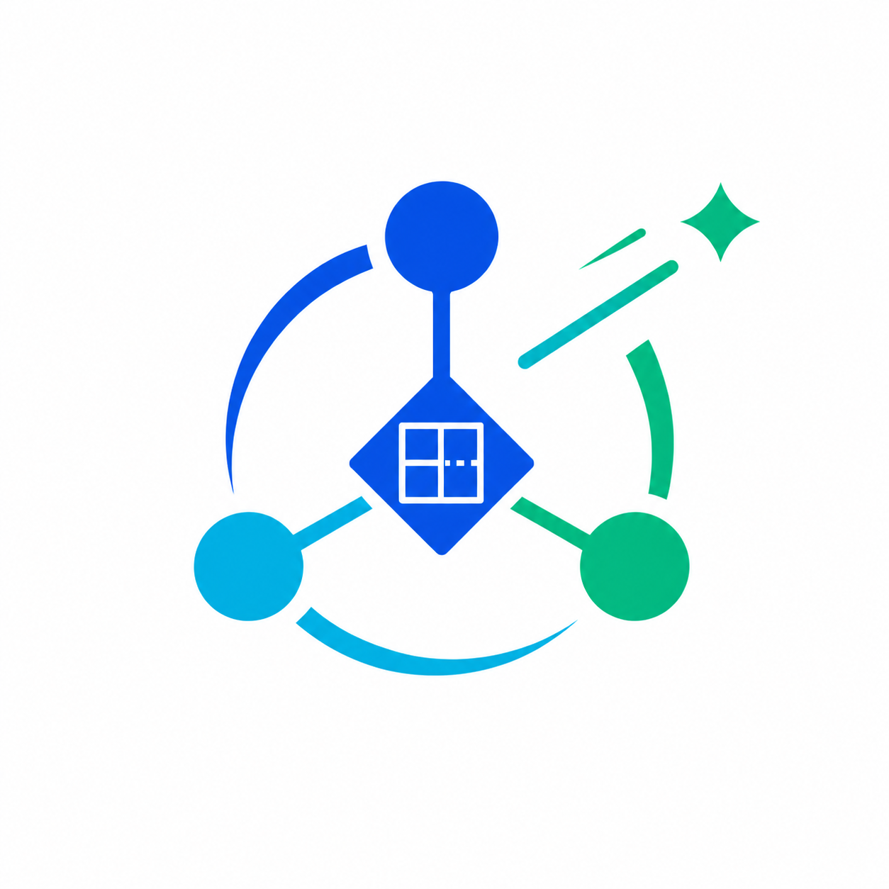

<p align="center">
  
</p>

# Agent Company

**Agent Company 是面向个人开发者的本地 AI 软件公司。** 你可以定义角色、组建团队，让真实的 Claude Code 与 Codex CLI 分别承担产品、架构、设计、前端、后端和测试工作，并在一个 Web 工作台中完成从需求澄清到开发验收的完整流程。

项目基于 [Hive](https://github.com/tt-a1i/hive) 的本地多 Agent 运行时演进而来，保留了真实 CLI 进程、PTY 会话、`team` 派单协议、WebSocket 实时上下文和 SQLite 持久化能力；在此基础上结合 **Archify**、**grill-me / to-spec** 与 **Stitch MCP**，将通用的 Agent 协作工作台收敛为适合个人使用的软件项目开发流程。

> 当前项目定位为 Windows 桌面端、本机单用户使用。Runtime 默认仅监听 `127.0.0.1`，不提供远程访问或多人协作服务。

## 核心理念：规划与执行分离

Agent Company 将一个项目拆成两个相互衔接、职责明确的流程：

| 流程 | 解决的问题 | 主要参与者 | 主要产物 |
| --- | --- | --- | --- |
| 规划流程 | 要做什么、为什么做、做成什么样 | 产品经理、架构师、UI 设计师、部门经理 | 封板需求、架构方案、架构图、UI 方案与设计图 |
| 执行流程 | 如何实现、如何验证、是否可以交付 | 前端工程师、后端工程师、测试工程师、部门经理 | 前后端代码、测试记录、部署脚本、验收结论 |

这个设计遵循一个简单原则：**把需求留在规划流程，把实现放进执行流程。**

- 在规划阶段先消除需求歧义，避免工程师一边猜需求一边写代码。
- 架构图和设计图必须经过用户确认；不满意可以持续修改，不会直接进入开发。
- 需求封板、架构确认和 UI 确认构成阶段门，只有前置条件满足后才能进入执行流程。
- 执行阶段围绕已经确认的目标开发、测试和验收，规划上下文不会被大量实现日志淹没。
- 每个角色拥有独立、可回看的 CLI 上下文，部门经理只负责编排，不代替专业角色与用户交流。

## 基础流程

1. **创建项目**：输入项目名称，系统在 `D:\project\agent-company-workspace\<项目名称>` 创建独立工作目录。
2. **需求澄清**：产品经理先结合项目名称思考，再通过 grill-me 逐轮提出最关键的问题。适合选择的问题会显示为可交互的单选项，用户可以“确认选择”继续沟通，或“确认并封板”结束追问。
3. **需求封板**：产品经理使用 to-spec 将对话整理为稳定规格。用户仍可补充需求；确认后，部门经理才会派发后续工作。
4. **方案设计**：部门经理向架构师和 UI 设计师派单。架构师使用 Archify 产出架构说明与可交互架构图；UI 设计师通过 Stitch MCP 产出界面方案或设计图。
5. **用户确认**：架构方案与 UI 方案分别确认。用户可以要求修改，直到两项方案都通过。
6. **开发实现**：前端、后端工程师依据已确认方案制定动态计划并逐项完成实现。
7. **测试验收**：测试工程师进行页面点击、交互检查、接口联调和端到端流程验证；发现异常后回派对应成员修复。
8. **交付归档**：设计、代码、文档和测试产物按目录汇总到归档文件；项目完成后可在本机部署运行。

## 主要特色

### 真实 CLI 团队

- 团队成员是本机真实运行的 Claude Code 或 Codex CLI，不是浏览器中的模拟角色。
- 角色可以配置名称、职责说明、提示词和默认 CLI。
- 角色模板的修改只影响之后创建的项目，已创建项目会保留当时的团队快照。
- 设置页可检测 Claude Code、Codex 及 Stitch MCP 的本机可用状态。

### 可观察的工作过程

- 团队面板显示成员状态、当前简要计划和完成情况。
- 点击成员可查看完整执行上下文，包括思考过程、工具调用、命令输出、派单和汇报。
- 正在运行的上下文会持续滚动更新，便于发现卡住、等待输入或执行异常的 CLI。
- 成员卡片只展示简短计划名称，完整任务要求保留在上下文中，兼顾可读性与可追溯性。

### 对话里的架构图与设计图

- Archify 已内嵌到项目中，架构师产出的交互式 HTML 架构图可以直接显示在规划对话上下文里。
- 图表查看器保留缩放、复位、全屏/独立打开等演示能力，不需要离开工作台寻找文件。
- Stitch MCP 的 UI 设计产物与架构产物使用同一套确认流程；用户可以直接反馈并要求迭代。
- 所有最终产物同时进入归档文件，支持打开文件或跳转到资源管理器。

### 面向交付的本地开发

- 项目按需求、设计、前端、后端、测试和部署等目录归档，不把所有文件堆在一个位置。
- 已交付项目可以从 Web 端本地部署；启动过程隐藏命令行窗口，并在端口冲突时重新分配端口。
- 项目收尾时生成 Windows 一键启动脚本，确保前端使用正确的后端地址。
- 删除项目时会同步删除项目工作目录、文档、消息、派单、运行记录和归档索引。

## 内置角色

| 角色 | 默认职责 |
| --- | --- |
| 部门经理 | 管理阶段门、拆分目标、派发任务、追踪异常和组织验收 |
| 产品经理 | grill-me 需求澄清、选项设计、to-spec 需求封板 |
| 架构师 | 技术架构、接口与数据边界设计，并用 Archify 输出架构演示图 |
| UI 设计师 | 视觉与交互方案设计，并通过 Stitch MCP 生成设计产物 |
| 前端工程师 | 按确认后的 UI 与接口契约实现前端功能 |
| 后端工程师 | 实现数据模型、业务接口、服务与本地部署能力 |
| 测试工程师 | 功能、交互、接口和端到端流程测试，推动问题闭环 |

这些角色是可编辑的模板，不是写死的 Agent。项目创建时会复制当前模板，因此你可以为未来项目调整职责和 CLI，而不会改变正在进行的项目。

## 本地启动

### 环境要求

- Windows 10/11
- Node.js 22 或更高版本
- pnpm 10
- 已安装并完成登录的 Claude Code 和/或 Codex CLI
- 如需 UI 自动设计，配置可用的 Stitch MCP 服务

### 开发模式

```powershell
pnpm install
pnpm dev
```

启动后访问：

- Web UI：`http://127.0.0.1:5180`
- Local Runtime：`http://127.0.0.1:4010`

`pnpm dev` 会同时启动 Runtime 和 Web UI。CLI 检测结果以启动 Agent Company 的 PowerShell 环境为准；如果刚安装了 CLI，请关闭旧服务并从能直接执行该 CLI 的新终端重新启动。

### 生产式本地运行

```powershell
pnpm build
node dist/src/cli/hive.js --port 4010
```

构建后的 Runtime 会直接提供 Web 静态文件，不再需要 Vite 开发服务器。源码中的部分 `hive` 文件名和 `.hive/tasks.md` 路径属于底层兼容协议，仍被 `team` 派单与任务状态同步使用。

## 配置说明

在左下角进入设置或角色配置：

- **角色配置**：修改角色名称、职责内容、提示词与默认 CLI。
- **CLI 检测**：检查 Claude Code 与 Codex 命令是否可用。
- **Stitch MCP**：配置命令、参数和连接信息，供 UI 设计师调用。
- **项目级团队**：项目创建后保存独立配置，不受之后模板修改影响。

## 项目目录

```text
agent-company/
├─ src/                 # 本地 Runtime、CLI 与共享协议
├─ web/                 # React Web 工作台
├─ vendor/archify/      # 内嵌的 Archify 渲染与查看能力
├─ vendor/skills/       # 从上游能力库提取的角色与工作流技能
├─ scripts/             # 本地开发、构建和验收辅助脚本
├─ docs/                # 当前项目的架构、设计与 QA 资料
└─ tests/               # Runtime、协议和 Web 行为测试
```

## 数据与安全边界

- Agent Company 默认只监听本机回环地址，不应通过公网隧道、反向代理或共享网络端口暴露。
- CLI Agent 能以当前 Windows 用户权限读取和修改所选工作目录，也能执行本机命令；只应创建或打开可信项目。
- 项目元数据、消息和运行记录保存在本地 SQLite 中，项目产物保存在对应工作目录中。
- 删除项目会级联清理数据和文件，请在操作前确认需要保留的成果已经备份。

## 开发约定

仓库的代码规范和提交规则见 [`AGENTS.md`](./AGENTS.md)。每项完成的修改使用 Conventional Commits 单独提交并推送，例如：

```text
feat: add role cli detection
fix: preserve utf-8 cli output
docs: simplify local project guide
```

Agent Company 当前专注个人本地完整项目开发，不包含 Hive 原有的远程接入、多用户服务、npm 公共发行和多种安装包维护流程。
